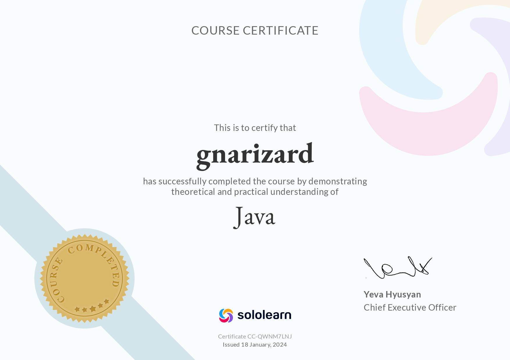
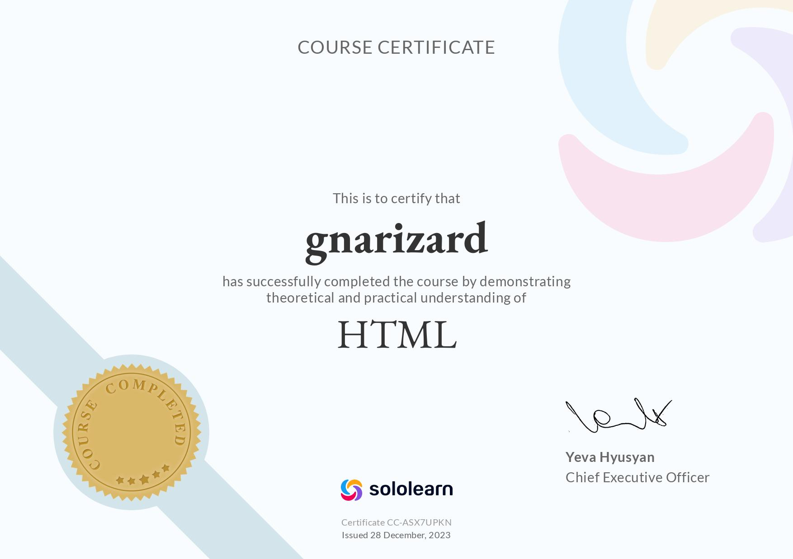
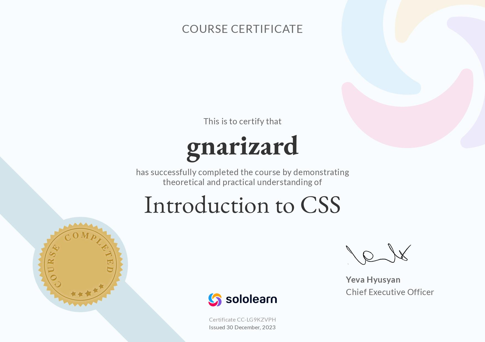
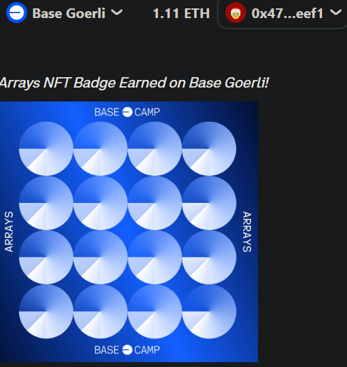
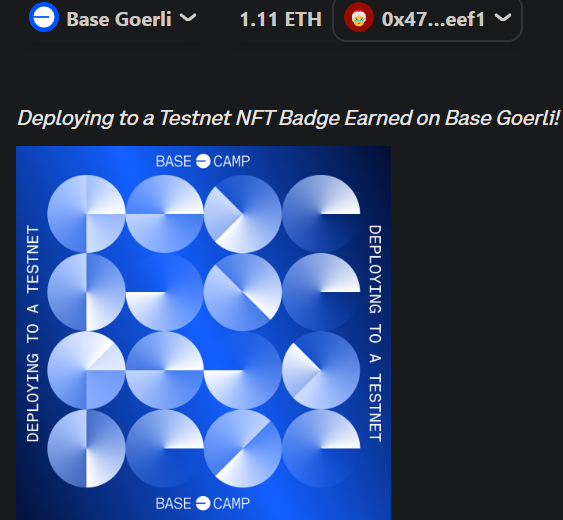
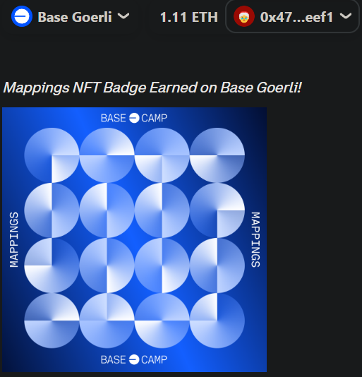
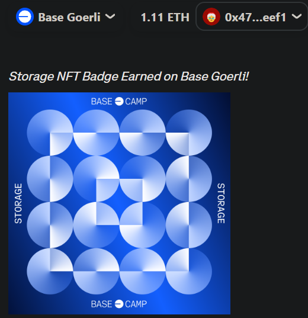

<!-- Start of GitHub profile README -->

<!-- SoloLearn Certificates Section -->
## SoloLearn Certificates

    
    
    

    
    
    

<!-- Base Camp Certificates Section -->
## BaseCamp Certificates

    
    
    
    

<!-- End of GitHub profile README -->
